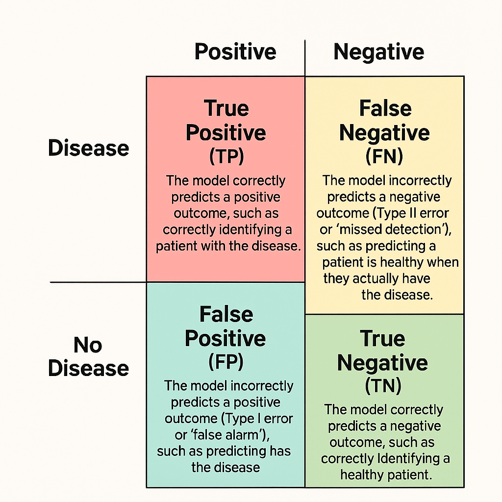

# 1.2 Evaluation Metrics for Classification 

# 🧠 Core Evaluation Metrics for Binary Classification

## 📊 Classification Metric Summary

Using a medical test for a disease as an example:
* **True Positive (TP)**: The model correctly predicts a positive outcome, such as correctly identifying a patient with the disease.

* **True Negative (TN)**: The model correctly predicts a negative outcome, such as correctly identifying a healthy patient.

* **False Positive (FP)**: The model incorrectly predicts a positive outcome (Type I error or "false alarm"), such as predicting a patient has the disease when they are healthy.

* **False Negative (FN)**: The model incorrectly predicts a negative outcome (Type II error or "missed detection"), such as predicting a patient is healthy when they actually have the disease. 

| **Metric**   | **Formula**                                                                 | **What It Measures**                                      | **When It's Important**                                                                 |
|--------------|------------------------------------------------------------------------------|------------------------------------------------------------|------------------------------------------------------------------------------------------|
| Accuracy     | $$\frac{TP + TN}{TP + TN + FP + FN}$$                                       | Overall correctness of predictions                         | Useful when classes are balanced and all errors are equally costly                      |
| Precision    | $$\frac{TP}{TP + FP}$$                                                      | How many predicted positives are actually correct          | Crucial when false positives are costly (e.g., spam detection, medical diagnosis)       |
| Recall       | $$\frac{TP}{TP + FN}$$                                                      | How many actual positives were correctly identified        | Vital when missing a positive is costly (e.g., fraud detection, cancer screening)       |
| F1 Score     | $$\frac{2 \cdot \text{Precision} \cdot \text{Recall}}{\text{Precision} + \text{Recall}}$$ | Balance between precision and recall                       | Best when you need a trade-off between precision and recall                             |

 
 
 ## [Context](./../context.md)