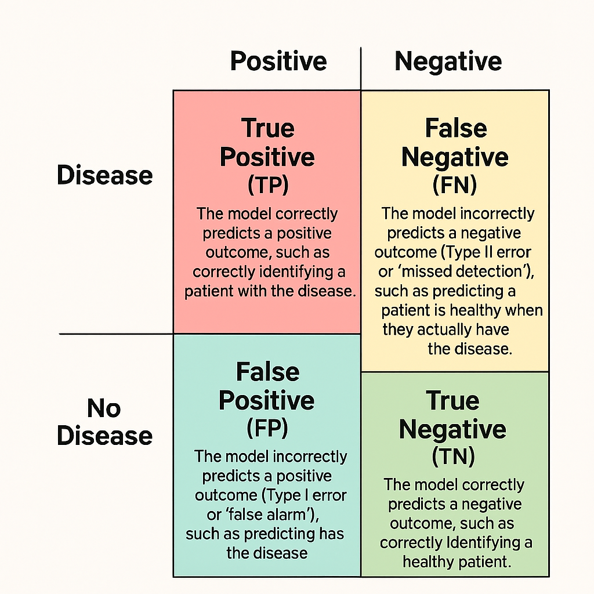

# 1.5 Confusion Matrices 
 
 # Confusion Matrices

A confusion matrix is a table used to evaluate the performance of a classification model. It summarizes the number of correct and incorrect predictions made by the model by comparing its output against the known, actual values

The matrix visualizes where a model "gets confused" and mislabels one class as another, providing more detailed insight than a simple accuracy score, especially for datasets with imbalanced classes.

## The basic structure 
For a binary classification problem—where there are only two classes, often labeled "positive" and "negative"—the matrix is a 2x2 table. The components are typically arranged as follows: 

|                 | Predicted Positive    | Predicted Negative   |
| --------------- | --------------------- |--------------------- |
| Actual Positive | True Positive (TP)    | False Negative (FN)  |
| Actual Negative | False Positive (FP)   |  True Negative (TN)  |

Using a medical test for a disease as an example:
* **True Positive (TP)**: The model correctly predicts a positive outcome, such as correctly identifying a patient with the disease.

* **True Negative (TN)**: The model correctly predicts a negative outcome, such as correctly identifying a healthy patient.

* **False Positive (FP)**: The model incorrectly predicts a positive outcome (Type I error or "false alarm"), such as predicting a patient has the disease when they are healthy.

* **False Negative (FN)**: The model incorrectly predicts a negative outcome (Type II error or "missed detection"), such as predicting a patient is healthy when they actually have the disease. 

## Example: Cancer screening model

For a cancer detection model tested on 205 patients, a confusion matrix might look like this:  

|                            | Predicted Cancer (Positive)   | 	Predicted Healthy (Negative)  |
| -------------------------- | ----------------------------- |------------------------------- |
| Actual Cancer (Positive)   | 100 (TP)                      | 	5 (FN)                        |
| Actual Healthy (Negative)  | 	10 (FP)                      |  90 (TN)                       |

Does the Patient has disease ?

| True Positive - Predicted YES (Disease) Actual  YES (Disease)   | False Negative - Predicted NO (HEALTHY) Actual  YES (Disease)     |
| --------------------------------------------------------------- | ----------------------------------------------------------------- |
| False Positive - Predicted YES (Disease) Actual  NO (HEALTHY)   | True Negative - Predicted NO (HEALTHY) Actual  NO  (HEALTHY)      |

Is the animal a cat ?

| True Positive - Predicted YES (CAT) Actual  YES (CAT)   | False Negative - Predicted NO (DOG) Actual  YES (CAT)   |
| ------------------------------------------ | -------------------------------------------------------------------- |
| False Positive - Predicted YES (CAT) Actual  NO (DOG)  | True Negative - Predicted NO (DOG) Actual  NO  (DOG)     |

This matrix shows the model correctly identified 100 cancer cases (TP) and 90 healthy patients (TN). It also missed 5 actual cancer cases (FN) and incorrectly flagged 10 healthy patients as having cancer (FP).

## Interpreting the results 

The confusion matrix allows calculation of various performance metrics beyond simple accuracy: 

* **Accuracy**: The overall percentage of correct predictions: \((TP+TN)/Total\)
* **Precision**: The proportion of positive predictions that were correct: \(TP/(TP+FP)\)
* **Recall (Sensitivity)**: The proportion of actual positive cases that were correctly identified: \(TP/(TP+FN)\) 

These metrics provide a more detailed understanding of the model's strengths and weaknesses, which is crucial in applications like medical diagnosis where the consequences of different types of errors vary. 
 
 ## [Context](./../context.md)